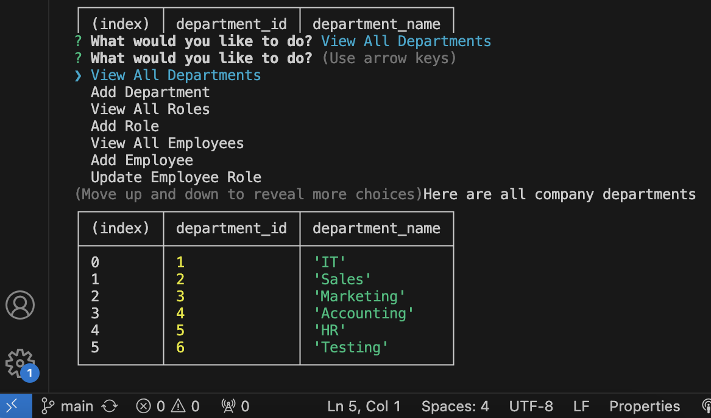
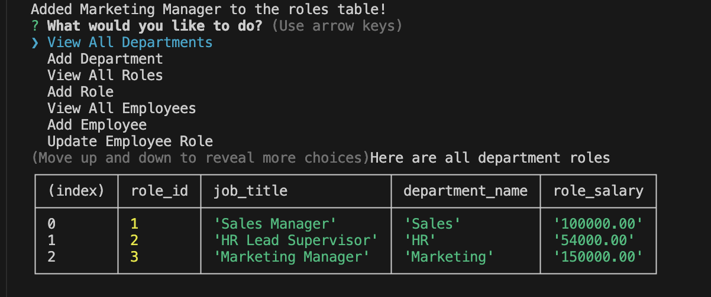
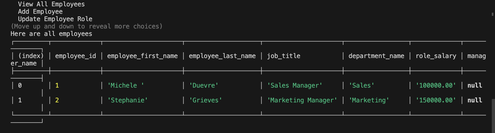
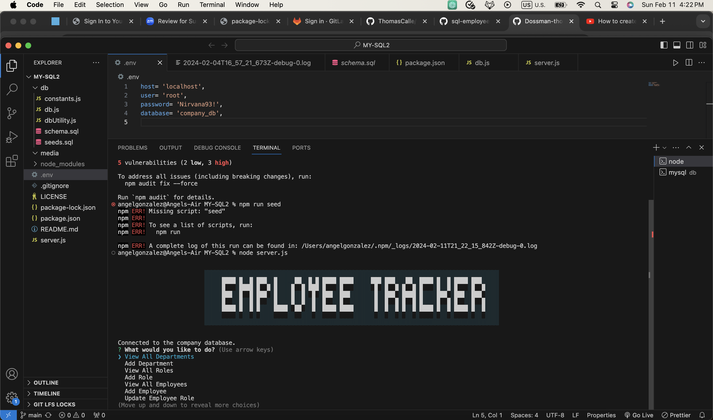

# MYSQL-EMPLOYEE-TRACKER

## License

[](https://opensource.org/licenses/MIT)

## User Story
```md
AS A manager at an internet retail company
I WANT a back end for my e-commerce website that uses the latest technologies
SO THAT my company can compete with other e-commerce companies
```

## Description:
A Node.js command-line application that allows users to manage a company database using Inquirer and MySQL. Users can view, add, and delete departments, roles, and employees.  

Additional functionality to update employee role or manager, to view employees by manager or department, and to view a utilized budget by department is included as well. 

## Table of Contents:

- [License](#License)
- [User Story](#User-Story)
- [Description](#Description)
- [Acceptance Criteria](#Acceptance-Criteria)
- [Screenshots](#Screenshots)
- [Demonstration](#Demonstration)
- [Installation](#Installation)
- [Running Application](#running-application)
- [Author](#Author)
- [Acknowledgments](#Acknowledgments)


## Acceptance Criteria

```md
GIVEN a command-line application that accepts user input
WHEN I start the application
THEN I am presented with the following options: view all departments, view all roles, view all employees, add a department, add a role, add an employee, and update an employee role
WHEN I choose to view all departments
THEN I am presented with a formatted table showing department names and department ids
WHEN I choose to view all roles
THEN I am presented with the job title, role id, the department that role belongs to, and the salary for that role
WHEN I choose to view all employees
THEN I am presented with a formatted table showing employee data, including employee ids, first names, last names, job titles, departments, salaries, and managers that the employees report to
WHEN I choose to add a department
THEN I am prompted to enter the name of the department and that department is added to the database
WHEN I choose to add a role
THEN I am prompted to enter the name, salary, and department for the role and that role is added to the database
WHEN I choose to add an employee
THEN I am prompted to enter the employee’s first name, last name, role, and manager, and that employee is added to the database
WHEN I choose to update an employee role
THEN I am prompted to select an employee to update and their new role and this information is updated in the database 
```

## Screenshots:

### Displaying All Departments

### Displaying All Department Roles 

### Displaying Employee List

### Running Application 



## Demonstration: 


## Installation:
```md
1. Fork or Clone my repository to your local machine.
2. Open the forked or cloned repository in VSCode or your preferred code editor.
3. Open the integrated terminal for the document and install all dependencies using command: 

`npm install`
```

## Running Application
```md
1. Run the application using command: `node server.js` in the file's integrated terminal.
2. User will be presented with a stylized title and a list of options that will manipulate the company database in several ways.
3. Upon selecting an option, user may also be prompted with follow up questions that will populate either the departments, roles, or employees tables. 
4. Once user is finished manipulating the data, choose the 'exit' option and the app will close.
```

## Author

Follow me on Github at [Utero93](https://github.com/Utero93) Additional questions or concerns? feel free to contact me at angel.m.gonzalez193@gmail.com. 
